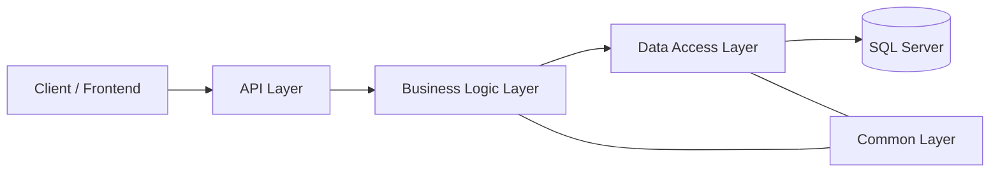
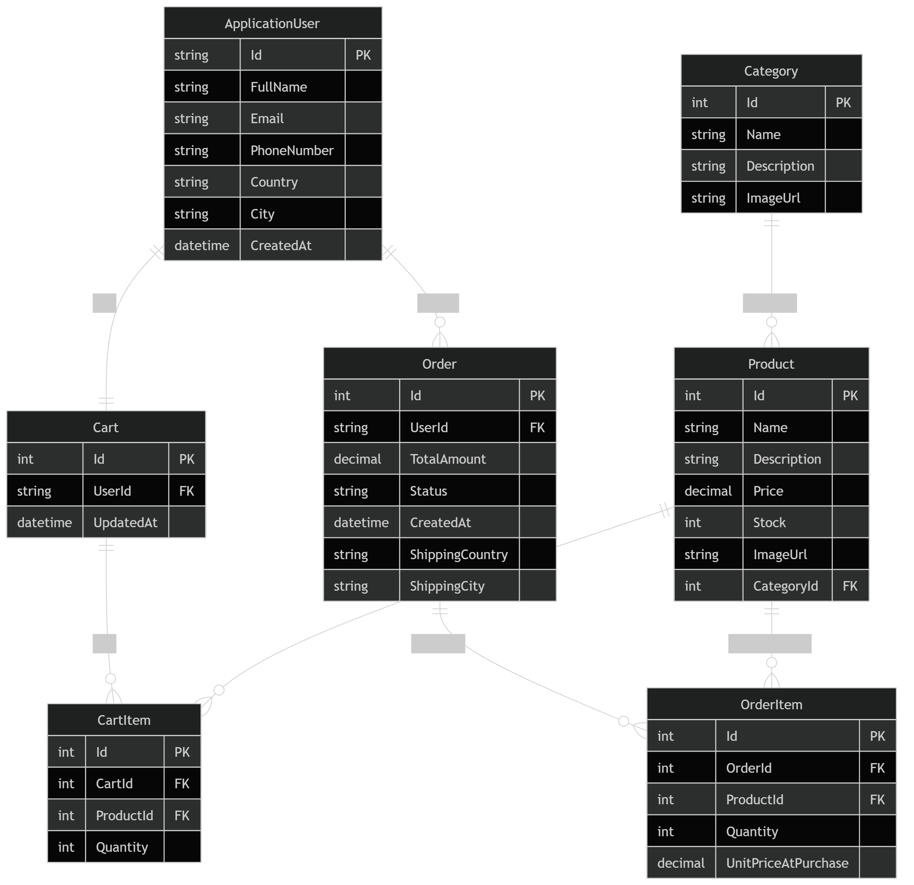

# E-Commerce API

<p align="center">
  
  
  
  
</p>

<p align="center">
  A production-style <strong>ASP.NET Core Web API</strong> for a modern e-commerce platform,
  built with <strong>3 Layers + Common</strong>, Repository Pattern, Unit of Work,
  JWT Authentication, policy-based authorization, DTOs, validation, pagination,
  and a clean manager-based business layer.
</p>

---

## Table of Contents

- [Overview](#overview)
- [Highlights](#highlights)
- [Architecture](#architecture)
- [ERD](#erd)
- [Main Modules](#main-modules)
- [Tech Stack](#tech-stack)
- [Getting Started](#getting-started)
- [API Overview](#api-overview)
- [Project Structure](#project-structure)
- [Response Pattern](#response-pattern)
- [Notes](#notes)
- [Roadmap](#roadmap)

---

## Overview

This repository contains the backend for an e-commerce system designed with a real-world layered architecture.
It separates responsibilities across presentation, business logic, data access, and shared contracts so the codebase stays maintainable, scalable, and easy to extend.

The project supports:

- user registration and login with JWT
- role-based and policy-based authorization
- product and category management
- shopping cart operations per authenticated user
- order checkout and order history
- image upload and URL-based association with products/categories
- unified API responses through a general result wrapper

---

## Highlights

- **Clean layered architecture**: API / BLL / DAL / Common
- **Repository Pattern**: generic + custom repositories
- **Unit of Work**: centralized save and transaction boundary
- **JWT Authentication**: secure API access with claims-based identity
- **Identity integration**: users, roles, and protected endpoints
- **Validation**: FluentValidation for request safety
- **Consistent responses**: `GeneralResult<T>` wrapper
- **Pagination**: product listing with paging support
- **User-based cart and orders**: `UserId` comes from JWT claims only
- **Image upload**: separate endpoint returning a reusable file URL

---

## Architecture



### Layer responsibilities

| Layer | Responsibility |
|---|---|
| API | Controllers, authentication, authorization, request/response handling |
| BLL | Managers, business rules, validation orchestration, DTO mapping |
| DAL | Repositories, Unit of Work, EF Core, Identity store, persistence |
| Common | Shared DTOs, result wrappers, errors, enums, helper contracts |

---

## ERD

The project ERD is included below. Keep `ERD.png` in the same folder as `README.md` for the image to render correctly on GitHub.

<p align="center">
  
</p>

---

## Main Modules

### Authentication
- Register a new customer
- Login with email/password
- Issue JWT access tokens
- Seed roles and default admin account

### Catalog
- Categories CRUD
- Products CRUD
- Pagination for product listing
- Product/category image URLs

### Cart
- Get current user cart
- Add item to cart
- Update item quantity
- Remove item from cart
- Auto-create cart when needed

### Orders
- Checkout from cart
- Create order and order items
- Snapshot price at purchase time
- Deduct product stock
- Clear cart after successful checkout
- View order history and order details

### Images
- Upload image files through a dedicated endpoint
- Return a public URL that can be stored in product/category records

---

## Tech Stack

- **ASP.NET Core Web API**
- **Entity Framework Core**
- **Microsoft Identity**
- **JWT Bearer Authentication**
- **SQL Server**
- **FluentValidation**
- **Swagger / OpenAPI**
- **Scalar** for API exploration

---

## Getting Started

### Prerequisites
- .NET 8 SDK
- SQL Server
- Visual Studio 2022 or VS Code

### Setup

1. Clone the repository.
2. Open the solution in Visual Studio.
3. Update the connection string in `appsettings.json`.
4. Update JWT settings in `appsettings.json`.
5. Run the database migration/update if needed.
6. Start the API project.

### Notes on configuration

- JWT settings are bound through a strongly typed `JwtSettings` class.
- Authentication reads the token from the `Authorization: Bearer <token>` header.
- `UserId` is extracted from JWT claims, not from request bodies.

---

## API Overview

### Auth
- `POST /api/auth/register`
- `POST /api/auth/login`

### Categories
- `GET /api/categories`
- `GET /api/categories/{id}`
- `POST /api/categories/create`
- `PUT /api/categories/update`
- `DELETE /api/categories/delete/{id}`

### Products
- `GET /api/products`
- `GET /api/products/pagination`
- `GET /api/products/{id}`
- `POST /api/products/create`
- `PUT /api/products/update`
- `DELETE /api/products/delete/{id}`

### Cart
- `GET /api/v1/carts`
- `POST /api/v1/carts/items`
- `PUT /api/v1/carts/items`
- `DELETE /api/v1/carts/items/{productId}`

### Orders
- `POST /api/v1/orders`
- `GET /api/v1/orders`
- `GET /api/v1/orders/{id}`

### Images
- `POST /api/images/upload`

---

## Project Structure

```text
ECommerce.API
├── Controllers
├── Services
├── Settings
└── Program.cs

ECommerce.BLL
├── DTOs
├── Entities
├── Interfaces
├── Managers
└── Validators

ECommerce.DAL
├── Context
├── Configuration
├── Identity
├── Repositories
├── Seed
├── UnitOfWork
└── ServicesExtension

ECommerce.Common
├── GeneralResult
├── Errors
├── Pagination
└── Shared Contracts
```

---

## Response Pattern

The API returns standardized responses through `GeneralResult` and `GeneralResult<T>` to keep success, validation errors, and not-found cases consistent across all endpoints.

Example:

```json
{
  "success": true,
  "message": "Success",
  "data": {
    "id": 1,
    "name": "Electronics"
  }
}
```

---

## Notes

- The cart and order features are user-scoped and depend on the authenticated user's JWT claims.
- Product and category image files are handled separately from the main CRUD flow.
- The image upload endpoint returns a URL so the frontend can store it inside the product/category DTO.
- The architecture intentionally keeps controllers thin and moves business rules into managers.

---

## Roadmap

- Add automated tests for auth, cart, and orders
- Add more order status workflows
- Add advanced filtering and search
- Add cloud image storage support
- Add API versioning improvements

---

## Why this project stands out

This project is not just CRUD. It combines:

- clean architecture
- real-world e-commerce workflow
- secure authentication
- user-based cart and order handling
- reusable response and validation patterns
- maintainable repository and manager layers

It is built to be easy to explain, easy to extend, and easy to present in a portfolio.
